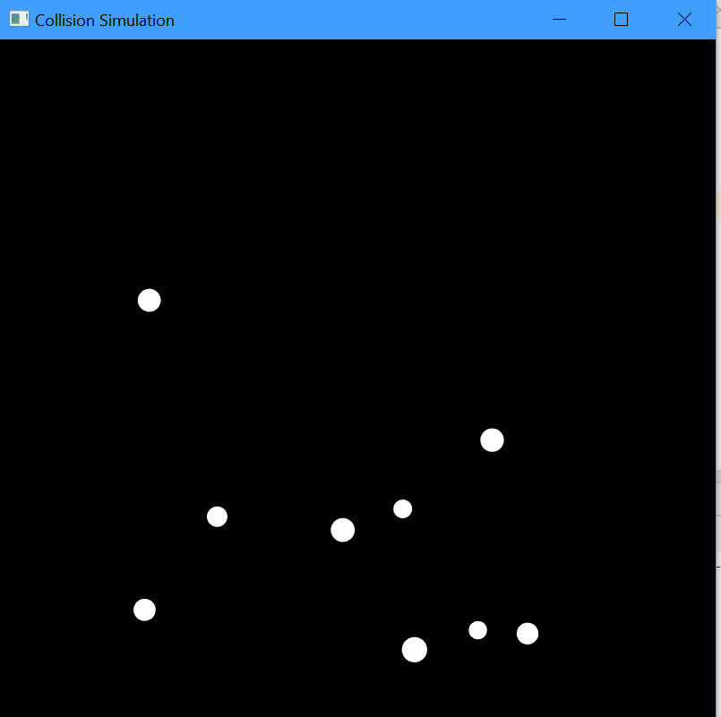

# 2D Physics Collision Simulation

Read [this document](https://cliutils.gitlab.io/modern-cmake/chapters/basics/structure.html) to understand the project
layout.

**Author**: Richwell Perez - [`richwell@illinois.edu`](mailto:richwell@illinois.edu)

## Description
This project simulates 2D particle elastic and inelastic collisions, includes gravity. This project uses [Cinder](https://libcinder.org/) and [Box2D](https://box2d.org/) frameworks. Currently, to use the simulation, you must generate a number of particles and assign each of the particles positions, applied forces, radii, masses, and restitutions (elastistic recoil). Running the app will visualize the particles and simulate physics events.

### Screenshot

